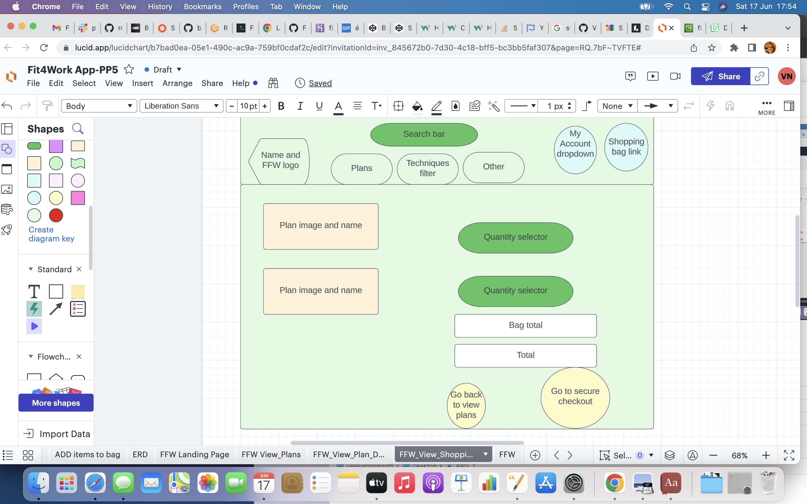

View the live project here.: https://fitforwork.herokuapp.com/

<h2><em>Introduction</em><h2>

Fit For Work is an ecommerce website that offers consumers workout plans that are tailored to suit their occupation.
It employs eight different Japanese techniques that are detailed on the website. These approaches are implemented in the design of 
the tailored workout plans. Consumers can choose their plan based on occupation type, the technique that they wish to implement in the approach, their goal for the workout plan (weight loss/muscle gain/general fitness) and the tier that they want to select (there are three different tiers that differ in what will be provided with the plan and the length of time support will be available for. Detail on the tiers and pricing can be accessed via dropdown in the landing page). Consumers can purchase these plans online using their credit card. They can also sign up to the facebook business profile which is linked throughout the site. They can also opt into subscribing for the nutrition newsletter which is a free subscription service, wherein a newsletter with nutrition tips and details on supplements is sent to their personal email each month.

<h2><em>Business model:</em></h2>

Currently the business is a business to consumer(B2C) structure but it will eventually evolve to include business to business services as well (in collaboration with gyms/personal trainers/fitness influencers/athletes/chefs/performers). This transition will be put into effect once the website has gained enough traction. Fit For Work has been registered as a Google business as part of the development process.

The Fit For Work app is in affiliation with, 'Pendulum to Paper Production Limited', which is a limited company registered with the Companies Registration Office in the Republic of Ireland.

<b>SEO:</b>

Various tactics employed to improve SEO

-I included meta tags for description and keywords within the base.html code. I ensured to include researched long-tail and short-tail keywords within the base.html meta tags block code. I was careful to avoid stuffing the meta tags, which would displease Google SEO raters.

Please see a screen grab of some documented research below (based on related searches in google):

Key Word Research 1: 
Key Word Research 2: 

-I used rel tags for hyperlinks to external code. I ensured to incorporate rel tags in the hyperlinks to external websites to improve the SEO. This is evidenced on the Founder page which includes several external links.

<b>Inclusion of site.xml file and robots.txt. file.</b>

The robots.txt file denotes what sections of the website should be ignored when the google spiders crawl the website to decide on where it should place within the google pages on search result. I have included my robots.txt file in the root directory, as specified in tutorials. It is a basic file currently as I don't think that any of the pages need to be ignored.

I ran a site.xml file on 'https://www.xml-sitemaps.com/' and have included this in the root directory, as specified in tutorials.

<b>Inclusion of privacy policy</b>

As inferred in the tutorials, this increases the credibility/legitimacy of the website. I created an original privacy policy for Fit For Work on https://www.privacypolicygenerator.info/live.php?token=AlWojlJjEgVKTE4IMDuUkaIsSscIhsz3 and included this in the 'Other' dropdown item in the main navbar.

<h2><em>Marketing strategy:</em></h2>
<b>Target Audience:</b>

Due to the nature of the business-'health and fitness' being all inclusive, it is very expansive and the scope of the reach of the app is not limited to a niche target audience. The fact that it ties occupation and fitness together is inclusive as opposed to exclusive. Everybody has a job (there are also plans available for the retired and unemployed even if they don't). Our occupation as the name suggests occupies us for most of our lives and, accordingly will have a pervasive impact on our health and fitness. This is why occupation is the primary lense through which the plans are designed. This way work can no longer be used as an excuse for avoiding addressing your fitness and health. We ensure that your work is not a barrier to fitness by making the workouts complimentary/designed to align with your occupation.

The plans are especially suitable for people who believe that their job/work schedule is presenting a barrier to their fitness. The workout plans offered are ideal for people who want assistance in achieving their desired level of work life balance. The team at <em>Fit For Work</em> will help consumers to carve out time where they previously believed that there was none.

There is a wide range in terms of the goals specified: Weight loss, muscle gain and general fitness.
Additionally, the job types designed to be all encompassing (not limiting): Sedentary, mobile, work from home, retired, unemployed.
The range of prices offered is based on the tier that the consumer chooses (ranging from 100e-500e), and the tiers are further explained on the Tiers page of the website. A different level of time commitment and intensity is expected for each of the tiers, as further described on the app.

<em>Facebook business profile:</em>
Link: https://www.facebook.com/photo/?fbid=113155328477784&set=a.113155365144447

What is the purpose of this/what does it add to the marketing of the website?:
 

The facebook posts are moderated by the administrator of the Fit For Work app. Comments, reviews, posts are encouraged. Facebook is an excellent marketing tool as it has huge presence and reach.
It's an effective visual tool to attract new consumers is to have 'Before' and 'After' comparative posts which include photos. These demonstrate success stories and as the occupation is stipulated, it might offer an avenue to people who thought a workout plan simlpy could not be provided for their type of job. Facebook allows for evidence based promotion.

<em>Nutrition newsletter</em>

I have included a mailchimp embedded sign-up form for consumers to sign up to receive the nutrition newsletter. The Nutrition newsletter sent fortnightly. An effort will be made to keep this relevant and engaging to retain the interest of the consumer and to also nudge people in the direction of signing up for a nutrition plan offering that will be offered soon. Company updates and links to socials will also be included on this newsletter. The tiered strcuture of the plans encourages customers to start with a tier 1 plan then to progress to tier 2 and tier 3. The Nutrition Newsletter will be a useful way of retaining interest and ensuring momentum is maintained throughout their journey.

<h1>Other paid avenues to pursue in managing the FFW App.</h1>

Other options that I will pursue at a future point - that I became aware of from tutorials but that are external from the course (due to requiring payment), are the following:
<ol>
<li>Google business</li>
<li>Google Analytics</li>
<li>Google Adwords</li>
<li>HotJar</li>
<li>Facebook Pexel</li>
</ol>

I will ensure to enlist the following google services to monitor, track and manage the website and related apps and profiles:

<b>Google business</b>

Upon reviewing the tutorials, I registered business with google.
One of the reasons for this is it improves search engine ranking for SEO key words.
Potential consumers are more likely to trust a registered business.
Registration for Google Business was free.
There are various other potential <em>positives</em> of this:
Alerts for user interactions
Detailed analytics could be provided...clicks, visits to profiles etc.
Updates provided in real time
There is flag process available for images/comments uploaded by visitors.
I didn't become to deeply involved with this in terms of analysis for project submission stage, to avoid
GDPR related issues.

<section>Screenshot:

</section>

Other avenues that I will be investing in in the future are google ads and google analytics. I did not invest in these for the purposes of the project to avoid getting involved in any GDPR related issues.

I also will monitor and manage the user interaction with the site using hotjar and Meta (Facebook) pixel as promoted on the tutorials.

GDPR consent form required to sign up for google analytics.
Toughest privacy and security policy in the world.
Many privacy and security standards don't apply to developers.
The GDPR website: https://gdpr.eu/

GDPR: I will pay close heed to GDPR, ensure that all facebok posts that detail the experiences of consumers are consent based. I will ensure all consent boxes are not ticked automatically as this would be a breach of GDPR.

Additionally, as aforementioned, I generated a privacy policy for 'Fit For Work' at the following website:

https://www.privacypolicygenerator.info/

Text webpage was provided for the Fit For Work app, informing users about how their data is being collected and processed.
Concise, transparent, easily accessible.

<b>User Experience (UX)</b>
 

I created a kanban board on github, outlining important user stories. I labelled them according to MOSCOW prioritisation and ensured that less than 60% of the stories were must haves.

<b>User requirements</b>
The things that I considered when assessing user requirements in terms of business plan:
<ul>
<li>Fitness and health</li>
<li>Exercises</li> 
<li>Plans</li>
<li>Ecommerce-ability to pay for something</li>
<li>Support throughout fitness journey</li>
<li>Evidence provided for success of following such plans in the past</li>
<li>Can view testimonials by individuals in similar occupations as consumer</li>
<li>Ability to review experience</li>
<li>Trial period</li>
<li>Probably something on nutrition</li>
</ul>

<b>User stories</b>
Kanban Board-link:

 As stipulated in the PP5 checklist, I changed the settings from private to public mode: 

In an effort to comply with agile methodology, I set up a kanban board and connected it with the project on Github. I labelled the user stories added according to MOSCOW prioritisation. I included acceptance criteria and tasks.

<b>First Time Visitor Goals</b>

<ul>
<li>As a First Time Visitor, I want to easily understand that the main purpose of the site is to provide workout plans tailored to the work schedule of the consumer.</li>
<li>As a First Time Visitor, I want to learn more about the company behind the website and the training/qualifications and experience of the people designing the plans.</li>
<li>As a First Time Visitor, I want to know more about the type of plans that are being offered and the techniques that they are based on.</li>
<li>As a First Time Visitor, I want to know what prices the plans will be.</li>
<li>As a First Time Visitor, I want to be able to easily navigate throughout the site to find content, which I can do by scrolling and utilising the clearly labelled NAVbar and footer.</li>
<li>As a First Time Visitor, I want to look for testimonials to understand what their users think of them and see if they are trusted. I also want to locate their social media links to see their followings on social media to determine how trusted and known they are.(Facebook business profile)</li>
</ul>

<b>Returning Visitor Goals</b>

<ul>
<li>As a Returning Visitor, I want to find information about different tiers and approaches for plans and prices.</li>
<li>As a Returning Visitor, I want my login information to have been saved and to autopopulate so I don't have to type it in.</li>
<li>As a Returning Visitor, I want to find the best way to get in contact with the organisation with any questions I may have.</li>
<li>As a Returning Visitor, I want to find  the facebook business profile.</li>
<li>As a Returning Visitor, I want to see what is involved with the other tiers and approaches.</li>
<li>As a Returning Visitor, I want to be able to buy the same plan or a different plan again and for my payment information to have been saved.</li>
<li>As a Returning Visitor, I want to be able to view my customer profile history.</li>
</ul>

<b>Frequent User Goals</b>

<ul>
<li>As a Frequent User, I want to check to see if there are any newly added plans.</li>
<li>As a Frequent User, I want to check to see if there are any new customer testimonials on the facebook business profile.</li>
<li>As a Frequent User, I want to sign up to the Nutrition Newsletter so that I am emailed any major updates and/or changes to the website or organisation.</li>
<li>As a Frequent User, I want to be able to quickly access the affiliated facebook business profile so that I can leave a post about my progress.</li>
<li>As a Frequent User, I want to be able to receive an award for purchasing numerous plans.</li>
<li>As a Frequent User, I want to be able to connect with other consumers or consumers who has a similar occupation or goal as myself.</li>
</ul>

<b>Prioritisation</b?>

As aforementioned, I incorporated MOSCOW prioritisation incorporated in terms of the user stories.
Labels were used effectively in the kanban board structure:

Must Have (Colour: Green):
Screengrab: 

Should Have (Colour: Yellow):
Screengrab: 

Could Have (Colour: Brown):
Screengrab: 

Won't have (Colour: Red):
Screengrab: 

I ensured that no more than 60% of user stories were labelled as 'must haves' as per advice from the tutorials.

Themes- The user stories could be packaged within the following themes:

<ol>
<li>Registration and login</li>
<li>Viewing and choosing plans</li>
<li>Viewing techniques</li>
<li>Learning about the founder, the company, the eudcation and qualifications behind the plan</li>
<li>Accessing the facebook business profile and seeing reviews/testimonials/posts of other consumers</li>
<li>Signing up for the newsletter</li>
<li>Purchasing plans</li>
</ol>

<em>Milestones:</em>

Noted the milestone feature available on github, to focus on completing various user stories in a certain timeframe. I had fully intended to create milestones for particular iterations of the user stories but unfortunately, I was too anxious to do so and did not put this into action. However, now that I am becoming adept at full-stack-framework projects, I will endeavour to apply this going forward. It is an excellent time management tool and allows for the pomodoro approach to be applied.

<em>Sprints</em>

Allocated amounts of time to set smaller goals-this certainly would have alleviated my anxiety and I will ensure to put this into effect for future projects.

<b>Design</b>
<b>Colour Scheme</b>

The main colours used for Fit4Work: teal, fuschia, black and white.

I used fuschia and the hover effect to make certain items pop (e.g. the loading spinner after submitting payment or the search/view bag buttons).

I employed AdobeColour to refine the teal colours to be used on the website:

https://color.adobe.com/search?q=teal#

I used colorpalette to decide on the colors.

Please see a color palette of teal used below:

I wanted something stark and contrasting but not grating (teal on white).
I also wanted something relatively formal to relect the occupation based theme (black and white).
The UI still felt flat after incorporating the above colours so I applied the stark and revitalising fuschia colour
to make certain items pop and so that the UI would not appear too mundane.

The background image chosen inkeeping with the occupation based theme and the teal colors. A man in a suit with a briefcase, climbing the stairs. Professional yet active.

<b>Logo</b>

Having reviewed other students repositaries via the peer-code-reveiw section of Slack, I noted that 
others were investing in logos on the website Looka and as I felt there was an option for a once off subscription without purchase and I felt that the logo, which could be used on the landing page as well as in the favicon added hugely to the UI, I purchased a logo for Fit For Work that was inkeeping with the teal and balck theme of the website.

I chose teal and stipulated that the website was fitness related and I have included the logo as an image beside the name in the header of the landing page and also as the favicon.

<b>Typography</b>

The Sofia Sans Condensed font is the main font used throughout the whole website with Sans Serif as the fallback font in case for any reason the font isn't being imported into the site correctly.I chose this font for Fit For Work as upon conducting Google Font Research, I felt that is was the most suited as it is vivid, sharp and I felt that it was in-keeping with the theme of professionalism and occupation.
 

I looked through a number of options of google font before deciding on this:

 Google font: 

<b>Imagery</b>

I put great efforts into rearching and pruning relevant images for the website. A picture paints a thousand words after all.

 I used a number of different free photo resources when pruning the suitable images. These resources has been shared ont he LMS. These included Unsplash and Pixabay websites.

  I ensured to install pillow with the following command also:
  pip3 install pillow
 And added it to the requirements.txt file of the project
 pip3 feeze > requirements.txt

 As demonstrated on the tutorials also, I hosted the images in a media folder file on Amazon Web Services also. I used a link to AWS to present the logo as a favicon on the app.

 AWS 1: 
 AWS 2: 

<h4>Summary of steps required to setting up AWS:</h4>
-Set up bucket, user and user groups on S3 and IAM on AWS website.
-Create AWS Access keys and add them to env.py file.
-Install Boto3 and Django storages. Freeze to requirements.txt. Add storages to installed apps in Settings.py.
-Add settings.py code for S3 pending on whether USE_AWS is in the environment.
-Add config vars to Heroku with USE_AWS set to true.
-Add all images needed to the relevant bucket on AWS.

<b>Socials</b>
<b>Facebook business profile</b>
 

As aforementioned, I set up a facebook business profile for the FFW app. I included the background image of the landing photo as the cover photo and included the original logo as the profile picture. I followed the steps as detailed on the tutorials. I included a link to the deployed app and also manufactured a post for a 'before/after' result for someone who followed one of the plans:

Review post on facebook business profile: 

An instagram account will be added afterwards once the business has build a bit as lack of followers would make for poor advertising at the moment.

I will also consider a tik tok profile as it is extremely popular with the younger demographic.

<b>Mailchimp:</b>

I followed the steps outlined on the tutorial to set up a mailchimp account. The setup was successful and I managed to subscribe to the nutrition newsletter and received a confirmation email to the email address that I provided on subscription:

Request to confirm subscription email: 

Confirmation of subscription email: 

<i> Wireframes and Lucidcharts:</i>

<em>Lucidcharts</em> was used to create the wireframes during the design process.

I found Lucicharts preferable to balsamiq due to the tabular format so I could compartmentalise elements of the design process myself and apply the pomodoro technique to each segment (focussing for specific time periods on each segment) even in the planning phase. Also, I am a very visual person so the element of shapes, tabs and clear 1-2-3 continuing visual structure assisted me in formulating the design.

 
To cement my understanding of the process and tutorials, I wrote up wireframes and summaries of tutorials as i made my way thorugh, with a view to aiding my comprehension of the course and being able to establish what should be included in the project and what should not be included:

<h3>Screengrab of numerous planning tabs on Lucidcharts:</h3>
1: 
2: 
3: 
4: 
5: 
6: 
7: 
8: 

Numerous tabs used, to write along with the tutorials and break down code as this helps me to solidify/undertsand what is going on and impacts my overall planning.

As I continued to grow an understanding of django and full stack frameworks, I added tabs to help me to understand.

Visual aspect helped me to solidify my understanding. 

<b>Rough sketch to gain understanding of ERD:</b>

<B> Fit For Work Enity Relationship Diagram (progression):
1: BASIC ERD SKELETON 
2. MORE ADVANCED ERD 

I created an ERD for the models, specifiying the field and how the models related to one another.
I wanted to ensure that I had three custom models, with models that were suitably different from the Boutique Ado walkthrough, without being overly complicated as well.
I also considered whether they had a one-to-one relationship versus many to one or one to many(Plan model has many foreign keys).

Landing Page Wireframe - View: 

Plans Page Wireframe - View: 

Plan Detail Page Wireframe - View: 

Bag Wireframe - View: 

Checkout Page Wireframe - View: 

Checkout Success Wireframe - View: 

Other wireframes include the add and edit plans wireframes and the various html tabs from the ffw app such as the privacy policy page, the page explaining tiers, the page explaining technqiues or the page discussing the founder.

<em>Dropdowns and searches</em>

Dropdowns and searches were a useful way of presenting the relevant filters for consumers.
It aided to the navigation of the website, with the customer able to search for particular words or filter by price, technique or goal.

<b>Database</b>

Elephant SQL used to create the database for the app and linked in with Heroku.

SQLite included with Django, inserted an if else statement in settings.py that would ensure the database url that was defined in. the env.py file would be used.

Removing migrations and remigration: At one point there was a major issue with the app and i had to manually delete all of the migration files except for init.py from the migration folders and remigrate everything to resolve it.

<h1><b>Features</b>

Existing features:

<ul>
<li>Filter</li> 
<li>Search</li> 
<li>Input card details</li> 
<li>Purchase plan</li> 
<li>Customer profile</li> 
</ul>

Future features:

<ul>
<li>Reviews-customers can leave reviews directly on the website.</li> 
<li>A contact us page</li> 
</ul>

<h1>Responsive on all device sizes</h1>

I ensured that the website was responsive across multiple devices, using Google Chrome developer tools, media queries (breakpoints),.
I employed a mobile first design approach.

Please see below screengrabs of website on various devices:

<h1>Methods to ensure site is responsive.</h1>
 <ul>
<li>Bootstrap used as per walkthrough</li>
<li>Container-fluid</li>
<li>Z-index</li>
<li>v-100</li>
<li>Media-Queries</li>
<li>Bulma used to centre font awesome icons</li>
 </ul>

<b>Interactive elements</b>
<ul>
<li>Hover over buttons- as influenced by walkthrough</li>
<li>Absolute header and footer</li>
<li>Forms, buttons changing colour and required fields</li>
<li>Loading bars- spinner once payment is going through</li>
<li>Animations-tiers animation on tiers tab</li>
</ul>

<b>Technologies Used</b>

<b>Languages Used</b>
HTML5 
CSS3
Javascript
Python

<b>Frameworks, Libraries & Programs Used</b>
Django

<b>Bootstrap 4.4.1:</b>.
Bootstrap was used to assist with the responsiveness and styling of the website.
I liked materialise also but noted in the tutorials, it was recommended not to use both frameworks simultaneously and bootstrap used as boilerplate code-stuck with bootstrap.

<i>Hover.css:</i>
Hover.css was used on the **Social Media icons** in the footer to add the float transition while being hovered over.

<i>Google Fonts:</i>
Google fonts were used to import the 'XX' font into the style.css file which is used on all pages throughout the project.

<i>Font Awesome:</i>
Font Awesome was used on all pages throughout the website to add icons for aesthetic and UX purposes.
Bulma used to ensure icons consistently aligned on all pages of the website-as per tutorials.

<i>jQuery:</i>
jQuery came with Bootstrap to make the navbar responsive but was also used for the smooth scroll function in JavaScript.

<i>Git</i>
Git was used for version control by utilizing the Gitpod terminal to commit to Git and Push to GitHub.
I tried to ensure my commit messages were always imperative.

<i>GitHub:</i>
GitHub is used to store the projects code after being pushed from Git.

<b>Testing</b>

Throughout the mtutorials for module five, we learned a lot about test driven development but it was specified also in the tutorials that this would not be expected for the project.

<em>Manual testing:</em>
I ensured to test every feature included in the app on each update and migration. I test the webhooks, paying heed to the status messages provided.

<b>Validators:</b>

The W3C Markup Validator and W3C CSS Validator Services were used to validate every page of the project to ensure there were no syntax errors in the project.

i>W3C HTML Validator - Results</i>

Link: https://validator.w3.org/

Screengrabs of HTML Templates tested:

founder.html: 
privacy_policy.html: 
technique.html: 
tiers.html: 

<i>W3C CSS Validator - Results</i>

Link: https://jigsaw.w3.org/css-validator/
Screenshot of results:

base.css: 
checkout.css: 
profile.css: 

<i>Javascript Validator - Results</i>

Link: https://jshint.com/
Screenshot of results:

stripe_elements.js: 

countryfield.js: 

<i>Python Validator - Results</i>

Link: https://pep8ci.herokuapp.com/

Results split out by app:

FFW:

urls: 
views: 

Plans:

form: 
models: 
urls: 
views: 

Checkout:

models: 
signals: 
urls: 
views: 
webhook: 
webhook_handler: 

Bag:

context: 
views: 
urls: 

Profile:

form: 
models: 
urls: 
views:

<i> Flake8 and PEP8</i>

Useful to ensure PEP8 and Flake8 compliant. Command-to output all issues into the terminal:

<b>python3 -m flake8</b>

It gives a list of all of the issues in the code so we can go through these one by one
control and click on line, takes you to line - code style and linting issues. Tells you
where you have imported something and not used it. I found this very useful when cleaning up code and ensuring that stray comments had not been left within the code. At times, lines that were too long were flagged but I did not adjust these as it would have made the code not work. Other occassions, I could adjust with spacing and indentation. I ignored any items flagged with regard to migrations files, as it was inferred to do so on the tutorials.

<h2>LIGHTHOUSE TESTING</h2>
I accessed the 'LIGHTHOUSE' testing tool via Developer Tools. Please see a screengrab of the successful lIGHTHOUSE testing below. I believe all %s are adequate:

Lighthouse on Google Developer Tools
Link: https://developer.chrome.com/docs/lighthouse/overview/
Screengrab: 

<Debugger>

PythonTutor and Javascript Tutor, as used in tutorials.
These were incredibly useful tools that allowed the user to visualise execution-steps through the logic of the code step by step.
Aids in identifying and isolating issues with the logic. Going forward I will use these more in projects but did not use them for this project.

<b>Further Testing</b>

<b>Browser based testing</b>
The Website was tested on Google Chrome, Internet Explorer, Microsoft Edge and Safari browsers.
<b>Device based testing</b>
The website was viewed on a variety of devices such as Desktop, Laptop, iPhone7, iPhone 8 & iPhoneX. (Developer tools)

A large amount of testing was done to ensure that all pages were linking correctly.
Friends and family members were asked to review the site and documentation to point out any bugs and/or user experience issues.

<b>Responsiveness testing:</b>
                       
  <table>
                <caption><b>Testing for responsiveness</b></caption>
                <tr>
                    <th><b>Iphone 12 pro</b</th>
                    <th><b>Macbook Pro</b></th>
                    <th><b>Ipad Air</b></th>
                    <th><b>Nest Hub</b></th>
                </tr>
                <tr>
                    <td>Site is responsive<=700px</td>
                </tr>
                <tr>
                    <td>Yes</td>
                    <td>Yes</td>
                    <td>Yes</td>
                    <td>Yes</td>
                </tr>
                <tr>
                    <td>Links/URLs:</td>
                </tr>
                <tr>
                    <td>Yes</td>
                    <td>Yes</td>
                    <td>Yes</td>
                    <td>Yes</td>
                </tr>
                <tr>
                    <td>Images work (on undeployed app):</td>
                </tr>
                <tr>
                    <td>Yes</td>
                    <td>Yes</td>
                    <td>Yes</td>
                    <td>Yes</td>
                </tr>
                <tr>
            </table> 

 
Screengrabs of different tests:

 Iphone 12 pro: 

 MacBook Pro: 

 Ipad Air: 

 Nest Hub:  

 2. To different browsers

 I opened the website on my laptop and it worked accordingly

 Browsers: Safari, Google Chrome, Internet Explorer, Firefox

  <table>
                <caption><b>Browser compatibility:</b></caption>
                <tr>
                    <th>Chrome</th>
                    <th>Safari</th>
                    <th>Internet Explorer</th>
                </tr>
                <tr>
                    <td>Intended responsiveness:</td>
                </tr>
                <tr>
                    <td>Yes</td>
                    <td>Yes</td>
                    <td>Yes</td>
                </tr>
                <tr>
                    <td>Intended functionality:</td>
                </tr>
                <tr>
                    <td>Yes</td>
                    <td>Yes</td>
                    <td>Yes</td>
                </tr>
            </table>   

 Throughout the development process, there have been noted issues with google chrome, where updates took horus to load. 
Safari has not caused any issues.

    Screengrabs of different browsers:
        Google: 
        Safari: 

 
<b>Known Bugs</b>
-1.On some mobile devices the Work pushes the size of screen out more than any of the other content on the page.
-2. Had issues in development due to database caching where app would not work on Google Chrome but would work on Safari.
-3. Had ongoing issues with webhooks and stripe. The checkout would not submit and loading spinner would run indefinitely.
-4. View plans call to action button on landing page was covered by main nav header.
-5. Issues with regard to the layout of the mailchimp subscription button and facebook link button.
-6. Techniques dropdown would not filter properly, did not filter the correct techniques.
-7. Updated models and migrations only applied to local environment, did not transfer to the deployed app.
-8. Images and plans appeared on local environment but not deployed code.
-9. Tabs would not open on deployed app

<b>How bugs were resolved</b>

-1. Issue with AWS...getting active keys...consulted with people on slack. There was an additional step to set up the active keys:
Screenshot:
-2. Cleared sessions via google developer tools and reloaded. Did not automatically resolve on Google Chrome. Waited overnight.
-3. Added different endpoints (local versus deployed app) on Stripe webhooks. Noted the error messages and what was causing them (payment_intent function created etc.) Targetted those areas in code and used diffchecker to cross reference against the source code for the Boutique Ado walkthrough. Ensured indentation and logic of code was correct. Removed and readded STRIPE Public and Secret keys to code and settings. Ensured they were present as config vars on the heroku app.
-4. Put styling directly into html file, adding padding until it was visible.
-5. Added the related html file to includes file and inserted this directly into relevant page.
-6. Reviewed all techniques related code. Sorting and filtering code. Ensured name was aligned with filter specifications.
-7. Consulted with fellow students on slack and added release code for migrations (makemigrations and migrate commands) to the Procfile.
-8. Consulted with fellow students. Had media files from gitpod in subfolder within the media folder on S3 bucket. Moved all images into the main media folder on AWS.
-9. Consulted with fellow students, added DATABASE_URL to env.py file

<b>Deployment</b>

Initial set-up of Repositary:
-I created my repositary on github and pinned the workspace to gitpod workspaces. I would open the repo from the pined workspace from this place going forward, to avoid installations reversing or deletion of my env.py file.
-I pinned my workspace under the CI Students dropdown banner due to limited coding hours.
-I follwoed the usual steps to set up my new repositary on github.
-I created a repositary, giving it a name and description.
-I also created an issue template for user stories and linked this with the project.
-Upon advice from tutor support, I wused the full-CI template as a template for starting my code.
-I ensured all relevant installations were completed (Django etc.) and frozen to the requirements.txt file with the following command:
pip3 freeze > requirements.txt
-I ensured to have an env.py file which held the SECRET_KEYs that I did not want to be visible and I included the env.py file in the gitignore file so it would not be exposed.

Deploying:
I set up a database on ElephantSQL by creating an instance the Fit For Work app
I copied the necessary database url from Elephant SQL 
-I created an app for Fit For Work on Heroku
-I started installing the config vars in the settings tab on Heroku, including the DATABASE_URL, AWS keys, Secret key and STRIPE keys
-I set Heroku up for automatic deployment so it would be linked to the repositary and everything would also be transferred to Heroku once aditional codes were added or if database models were created/deleted and migrations were made. I ensured to check the build logs on heroku each time I migrated code or committed code to ensure everything wa supdated correctly.

<b>Checklist for PP5</b>

Please see below how the criteria checklist included on the LMS for PP5 has been considered.

-External html links tagged as non-rel for SEO purposes: Numerous links to external resources found on the founder page.
-CRUD: Admin or general user. CRUD functionality fully enabled for admin user logged in.
Can edit, delete or add plans to the website, enabling full crud functionality.

<b>Login details for admin: </b>

login name: Valerie

login password: Lauragym1!

-With regard to ensuring Authentication was operable-the Django allauths were used. Log in/log out and registration functionalities fully enabled.

-Responsive design
Use of media queries for breakpoints
Absolute header and footer
Use of bootstrap
Use of CSS design
Tested on google developer tools across a range of devices. Please see pictures below

-Inclusion of site maps and robots.txt file
-Mailchimp subscription included
-3 custom models included
-Stripe functionality working
-AWS has caused issues, ensured the images were included in the correct folder in the s3 bucket today
-Set DEBUG to True

<b>Credits</b>

<h1>Code:</h1>

For the coding, I consulted with Slack a lot for this project. I researched other projects on the 'Peer code review' page, researched the repositaries of other students (particularly Roman Rakic and his project 'Blade') to see what approaches were taken.

Tutor support - ensured to use my allocated ninety minutes a week to talk out various code related issues with the tutors on the LMS tutor support platform. Always pointed me in the right direction.

My mentor, Mitko Bachvarov was very helpful to me. He was extremely patient, helpful and flexible when setting up our sessions. We had all three mentor sessions at the recommended pacing (Beginning for project inception, Middle for when project is roughly complete and End when the project was about to be deployed.)

Bootstrap4: The Bootstrap Library was used throughout the project, mainly to make the site responsive, using the Bootstrap Grid System. It was also used for buttons and various other design features. I was interested in using Materialise also but did not as the two cannot be used together.

I used the CI README template as a premise for this README.

<b>Content</b>

I derived a lot of inspiration for the project from the Boutique Ado walkthrough project, provided by Code institute. I completed this walkthrough project twice (including deployment to Heroku twice). I used the code from the walkthrough as boilerplate code to use as a foundation for my own project on my second completion of it, customizing and altering the code to suit my idea as I progressed through, based on the idea and models for Fit For Work.

<b>Media</b>

The images used for the plans on the website were pruned from the following resources:

Pixabay
Unsplash
The before and after photo on the founder page is from my own personal photos.

Colours: Adobe colors and colormind.io.

Logo: Looka (idea inspired by fellow students on slack Peer Code Review page)

Fonts: Google Fonts

Icons: Font Awesome

Favicon: Favicon-using original Looka logo to build this.

Lucidcharts-for planning and wireframes

 Animation: I took the animation used on the Tiers page form the following source: https://tenor.com/en-GB/view/%C3%A9de-chorar-valtatu%C3%AD-cry-sad-tears-gif-16739376

Used for sitemaps: https://www.xml-sitemaps.com/

Used to generate FFW policy: https://www.privacypolicygenerator.info/live.php?token=AlWojlJjEgVKTE4IMDuUkaIsSscIhsz3

<b>Acknowledgements</b>

My Mentor Mitko for continuous helpful feedback.
Tutor support for their assistance throughout the process.
Slack community who were extremely forthcoming and responsive.
My friends and family for helping me throughout the process.

